footer: @erikpub & @ThatDocsLady
autoscale: true

—

# [fit] Healthy Minds __*in a*__
# [fit] Healthy Community

### Erik Romijn __*@*__erikpub
### Mikey Ariel __*@*__ThatDocsLady

#### __*DjangoCon Europe, March 2016*__

^ Hello everyone, welcome again to DjangoCon Europe, we're very happy to be here and want to thank the amazing organizers for putting together an amazing conference. Today we'd like to talk to you about healthy minds in a healthy community.

—

# Who are we?

### Erik Romijn __*@*__erikpub
### Mikey Ariel __*@*__ThatDocsLady

—

# [fit] Code of Kindness      No on-stage Q&A

^ Some housekeeping before we start:

^ We’d like to ask everyone who watches, listens to, or reads a transcript of this talk to keep in mind that the point of this talk is to generate higher levels of trust and openness, which means that whatever is shared should be handled with care, during and after the talk. 

^ We’re going to be touching some sensitive issues and there will probably be some personal conversations after this talk about these subjects by people who might not have had the courage to discuss them before. This makes it even more harmful to them and to you all as a community if this information is mishandled.

^ We're also not going to take questions during the presentation, because of the nature of the subject. After the talk there will be a 30-min break, and we'll be in the music library upstairs and available to chat with anyone who wants to ask anything about what we talked about. We feel that this format is more conducive to effective Q&A with this subject.

^ TIME SLIDE END: 2:30

—

^ TIME SLIDE START: 2:30

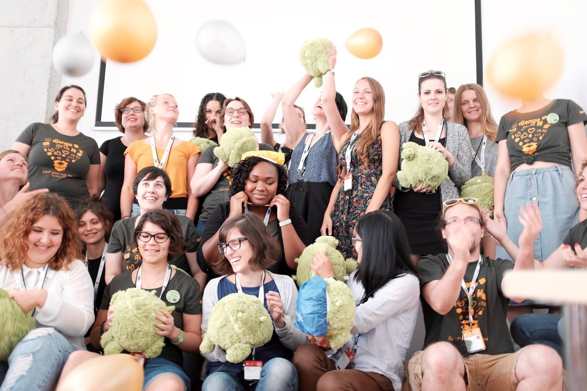

# [fit] None of us are
# [fit] **alone**

^ I’d first like to talk about why none of us are alone. With many people I meet, it often feels like they pretty much have their entire life together. They tell me about their wonderful work, they seem to get along with everyone instantly, have a ton of friends and they’re always doing something awesome with awesome people. It seems entirely smooth sailing for them. 

^ However, over the years I’ve found that when I get to know some of these people better, they sometimes open up and I find out how wrong I was.

^ https://flic.kr/p/w1W6ps

—

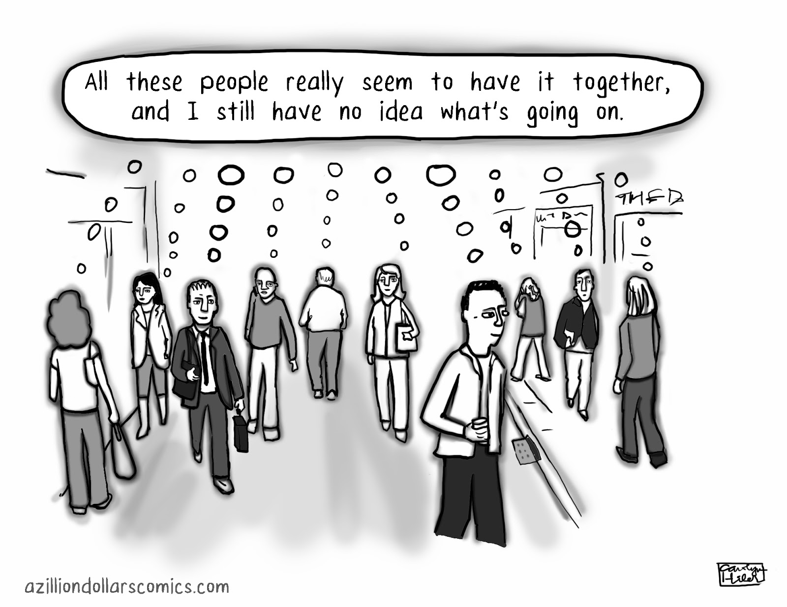

^ Because I’ve found that for many of the people that I admired the most and sometimes even envied, the people that seemed to have everything together more than anyone else I know, I was wrong. 

^ When they open up to me, there are stories of depression, crippling anxiety, OCD, PTSD, or even self-harm. I have felt completely blindsided again and again about how serious these stories sometimes are. And even more impressed by what these people accomplish regardless. 

^ It’s left me increasingly thinking that I probably know very few people that have never struggled with their well-being, but that many of them simply haven’t felt comfortable enough to be open about it yet. And they don’t have to if they don’t want to, of course. 

^ However, it’s taught me that no matter how successful someone may appear, and how amazing their work is or how their creativity seems boundless, they may very well be spending tremendous amounts of energy just to get through daily life.

^ And this isn’t uncommon...

—

# [fit] **1 in 4**
# [fit] experience mental illness in their lifetime

^ … because around one in four will experience mental illness in their lifetime. That could be something that’s present your entire life and already affects you now, like a development disorder, or something that surfaces later, like burnout or OCD. 

^ Once it shows, it might affect the rest of your life, or it might be resolved within a few years. But one hundred people in this room have or will go through such an experience in their lifetime.

^ That’s still quite a minority. But many people struggle with their well-being without necessarily meeting the criteria for a diagnosis of a mental illness.

—

# [fit] **70%**
# [fit] regularly experiences physical symptoms due to stress

^ For example, in office workers, 70% regularly experiences physical symptoms due to stress. That means their stress level is regularly so high, that it results in being excessively tired, having head and neck pain or other problems. That may not meet the bar for a mental illness diagnosis, but in the long term, such high stress levels are harmful.

^ So even though a minority might experience a mental illness, a large majority will or is already suffering from issues that affect their well-being and have an impact on their life.

—

# [fit] A lesson in
# [fit] **Dutch**

^ I want to do a quick lesson in Dutch.

^ https://en.wikipedia.org/wiki/Stroopwafel#/media/File:Stroopwafels_01.jpg

—

# [fit] ‘Hoe gaat het?’
^ “Hoe gaat het” means “how are you”. How do you answer to this question?

—

# [fit] ‘Hoe gaat het?’
# [fit] ‘Goed!’

^ You say “goed” which means “good”. This isn’t actually a question of how you are. This is a routine greeting where the only correct answer is “goed”. Many other cultures have this too.

—

# [fit] ‘I’m fine, I’m
# [fit] just __*tired*__...’

^ It’s like saying “I’m fine, I’m just tired”. Hiding our issues is ingrained into many of our cultures. Little lies in general are:

—

# [fit] ‘Your call is important to us’

^ But all jokes aside, I tend to do this too. The reality of it is though:

—

# [fit] There are other people __*in this room*__
# [fit] with similar struggles.

^ I know that there are people in our community that are struggling. Sometimes a lot, sometimes a little. I know some of these people and have heard their stories, but not nearly all of them. It’s left me convinced that if you’re struggling, there are very likely to be other people in this room that know exactly how you feel, and understand.

^ There are a bunch of people in this room that suffer from depression. People with low self-esteem. A history of eating disorders. Social anxiety. Self-identity issues.

^ And there are even more people that may not struggle in the same ways as you, but that also understand, because they know what it’s like. I don’t know who exactly all these people are. But I know they’re here.

—

# [fit] **1 in 10**
# [fit] DjangoCon Europe 2015 attendees spoke to a __*counselor*__

^ At DjangoCon Europe 2015, free confidential counseling sessions were available to all attendees. One in ten attendees used this service. You could just take a post-it with a timeslot from a board, and you’d get 25 minutes with a counselor. We got some anonymised data from these sessions.

^ 25 minutes is not enough to resolve serious issues, but it can help to set people on a path to feeling better. I speak from personal experience. Sometimes with self-care, sometimes suggesting professional care, sometimes a mix of both.

—

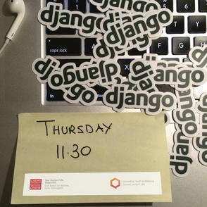

### __*”It’s been a relief to finally say these things to someone and have acknowledgment of the problem.”*__

### __*”I found it useful and relaxed and feel like I am not crazy or alone. This is normal!”*__

^ My two favourite bits of feedback from the well-being sessions were: It’s been a relief to finally say these things to someone and have acknowledgment of the problem and
I found it useful and relaxed and feel like I am not crazy or alone. This is normal!

^ They reflect well how people generally felt about the sessions. Not an immediate fix to all your problems. But a place to say things out loud and not be afraid of being judged. To feel validated and acknowledged that your problems are real, even when they might not be the same or might not be as serious as those of other people. 

^ Because it’s also easy to assume your struggles aren’t serious enough to need care.

^ This is also what we’re trying to do here today.

—

# [fit] We’re not mental health professionals.
# [fit] But we __*can*__ make a difference.

^ I am not a trained mental health professional. I am neither trained nor professional.

^ So we can't treat your eating disorder. After this talk, and despite all the other work we’re doing, your anxiety will still be there. The stress or insecurities won’t be gone. But like short counseling sessions, even though we’re not professionals, we *can* make a difference.

^ That we includes you. That includes all of our community. Every single one of us. By being considerate, empathic, accepting and understanding. And, for example, help anyone who is struggling feel validated and not alone...

—

# [fit] None of us are
# [fit] **alone**

^ … because none of us are. Whether you’re struggling with multiple complicated serious disorders, or just feel like sometimes the stress is taking a toll on you. Our struggles are valid because they’re impacting our lives. Know that whatever you’re struggling with, you aren’t crazy, you aren’t any less lovable, and most of all, you’re not alone in our community.

^ TIME SLIDE END: 9:00

—

^ TIME SLIDE START: 9:00

# [fit] help __*yourself*__...

^ So now that we know we're not the only ones struggling and that we're not suffering from unicorn problems, I'd like to talk about the first steps that we can do to help ourselves out of whatever is troubling us. This part is very personal for me, because I'm one of those people whom Erik mentioned as appearing to "have it all and keep it together" all the time. Naturally, the last thing I ever want to do is admit that I'm struggling. That I'm overwhelmed. That I am not a superhuman. 

^ But how do I end up so overwhelmed? I am a (mostly) responsible, functioning adult, and yet I seem to constantly be fighting against myself to balance all my work tasks, projects, conferences, hobbies, friends, and sleep (when I can). I'm generally liked, people value my contributions and my company, and I get a lot of satisfaction from participating in projects for the greater community.

^ This is exactly where the problem starts, because somewhere along the way I forgot that I need to help myself...

^ https://500px.com/photo/134275491/help-by-habibullah-al-mahmud

—

# [fit] ... __*before*__ you
# [fit] help __*others*__

^ ... before I can help anyone else. Whether it's my excitement about a potential project, an invitation to speak at or organize a conference, or my workplace increasing my workload because "I am a rockstar who can do everything", I get caught up in my desire to contribute, to help, to be a part of something, that I lose control over my time, energy, and mental resources.

—

# [fit] When being __*helpful*__
# [fit] doesn't help __*you*__

^ And that's where things start to get dangerous for me. When I forget that ultimately, my participation is supposed to create a positive impact not just on my peers, community, or world, but also on ME, then being helpful doesn't help me. This phrase that I heard from a community member and now it's more of a mantra for me, pretty much puts any project to the WIIFM test ("what's in it for me").

^ If this sounds selfish to you, consider that putting yourself first is not always selfish, and sometimes it might even save lives.

—

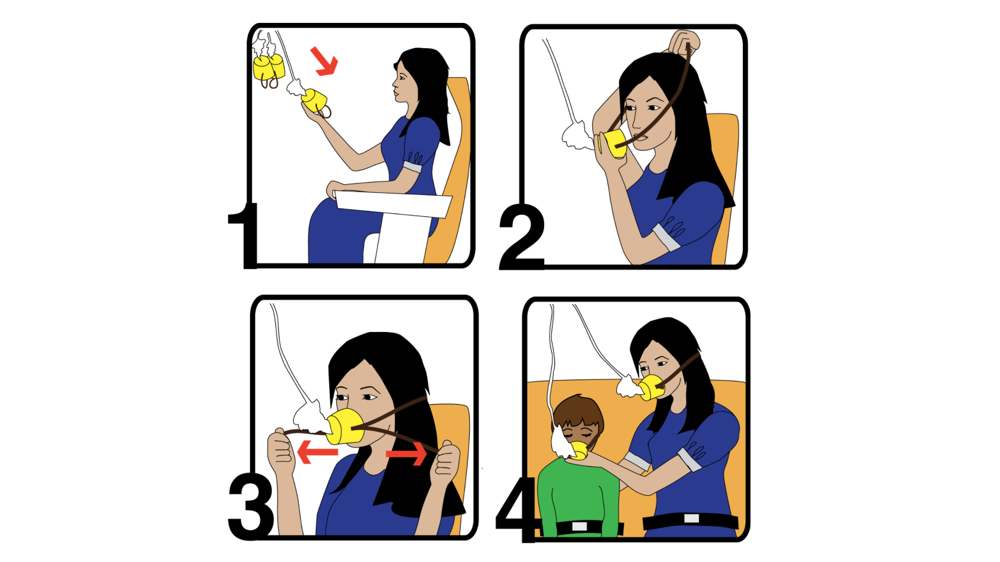

^ If you've flown before you might recall the safety instructions for putting your oxygen mask on in case of loss of cabin pressure, and the last square shows that only after putting on your own mask, you should help others who might need assistance.

^ There is a very important reason for this instruction. If the person who needs your help passes out from lack of oxygen, there's still time before they suffer serious health impacts. But if you try to help them and you run out of oxygen yourself, you both pass out and nobody can help anyone. 

^ In other words, if you take care of your own well-being first, you can still help others. But if you forget to take care of yourself and first focus on others, you might run out of air before you can help them. 

^ https://lifefitnessbydane.com/2015/10/21/mother-or-martyr/

—

# [fit] It's ok to say __*no*__
# [fit] * and it's even ok to say __*no more*__

^ I already mentioned that I am at risk of over-commitment because I either get excited about things and want to participate, or I'm invited to participate and I feel valuable and validated for it. Of course this means that I have a pretty hard time turning down project offers or stepping down from projects that I already joined.

^ But why is it so hard for us to say “no” to a potential project? And why is it even harder to say "no more" when we need to step down from a project?

^ From my own experience and from what I discussed with others, there are two main reasons for this: One, I am afraid that if I turn down or step down, it means that I failed. And two, I am afraid that if I turn down or step down, people will respond in a negative way. 

^ So how can we address these fears and gain the needed confidence to make these decisions?

—

> Just because you **can**, doesn't mean you **should**.
-- Anyone with experience in turning down project offers

^ When Erik asked me to help him build and present this talk, I'd just changed careers (for the third time), moved cities, shifted from office work to home-office, and had about a million and one projects going. At some point Erik confronted me with what I should have confronted myself with - I was dropping the ball on the stuff that I promised to do for the talk, and I was risking the whole collaboration because I tried to juggle too many things.

^ Thankfully, Erik is a dear friend and this talk is about well-being, so the conversation was positive and productive and I was able to admit that I have a problem. Then it was my turn to take a look at all the things I had going on, and make a hard decision - what do I let go of. 

^ You can guess from seeing me here that I prioritized this talk, but I will say this - working on this talk has taught me a lot about myself and helped me personally in so many ways, I hardly feel like a failure for stepping down from other projects. Having the opportunity to create something positive that helps me and hopefully others to be happier made it all worth it for me.

—

# [fit] Sustainable
# [fit] Open-Source(__*rer*__)

^ We must remember that sustainability isn't important only for our open-source projects, but to the open-sourcerer too. It's much more simple than you think: If I burn out I am more or less useless to myself and others, so I can't let short-term satisfaction or validation impact my long-term capacity.

—

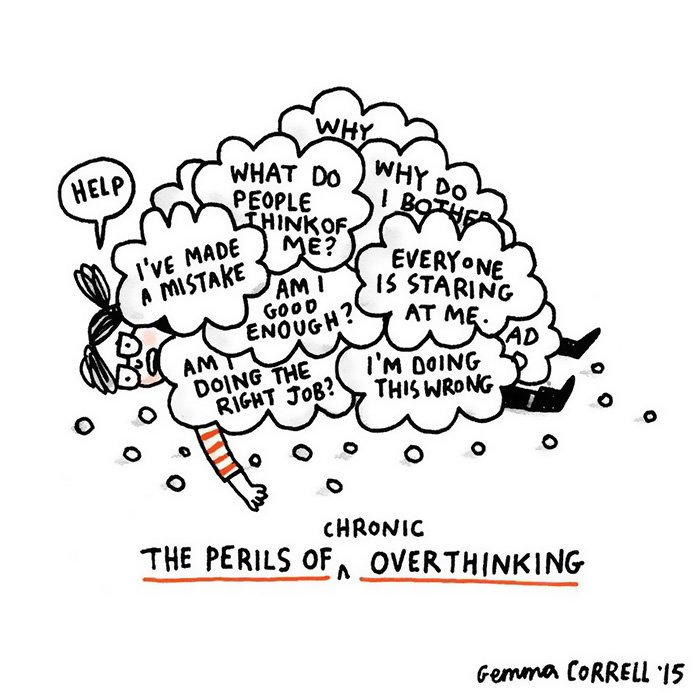

^ So now you looked at your project commitments, at your free time (what's left of it) and you realised that you really must balance your life better. Now you need to communicate this to your peers, which brings us to the second reason why saying “no” or “no more” is hard: What will people think?

^ Unfortunately, even after you admit to yourself that you  need to trim down on your commitments, the next step of actually communicating this to your project peers or to the community can seem like an even bigger hurdle. 

^ If we look at long-term open-sourcerers, the prospect of stepping down becomes even scarier. I've spoken to some veteran contributors who described how people started building expectations from them because they're core members of the community, and slowly they feel more trapped in their roles because "the project might fail if they leave" and "they can't let the community down". 

—

# [fit] What you do __*≠*__ Who you are

^ Humans are social creatures, and most of us work at jobs without a clear “finish line”, so ongoing, always-developing, never “done”. This means that we're constantly dependent on subjective feedback from our peers, and if we combine this with a culture that encourages over-achievement and over-commitment, no wonder we're sometimes terrified of saying “no” or “no more”.

^ Also, community of volunteer contributors means that nobody HAS to do anything. We WANT to contribute, we get (and give) immense value doing it, but this is all “at-will”, even more so than our jobs. If we suffer through projects, conferences, or responsibilities, then there is no love in the creative process, and we're not serving anyone, least of all ourselves.

—

> Everyone appreciates your honesty, until you are honest with them. Then you are an asshole.
-- My brain, every time I need to deliver bad news

^ And it doesn't matter how many times people tell me "it's ok to step down", "people will understand", "just be honest", my brain will always dive into the countless imaginary scenarios of what it would be like if I took that step, and most of these scenarios don't involve much understanding or acceptance. 

^ But then I had to step down from some projects, and people took it with kindness and understanding, and I realized that my fear of the unknown will almost always be more destructive than the consequences of my action. Even if some people are offended or respond badly to this step, it's usually indicative of their own fears or insecurities as they will need to make adjustments too.

^ If we accept that we can only be helpful if we can retain our health and balance, then we can face our peers with confidence that our action won't just help us, but also help the project or community because it will make space for someone else to step in. 

—

^ So please - put your oxygen masks on first, otherwise you'll run out of air before you can help anybody else. Whether it's taking a moment to think about if you want to join a potential project, or taking a few moments to figure out which project is draining your energy and needs to be let go, don't let your fears paralyze you from taking care of yourself.

^ TIME SLIDE END: 17:00

—

# [fit] This might sound __*easy*__
# [fit] but many things push us towards
# [fit] **over-commitment**

^ [ERIK]

^ TIME SLIDE START: 17:00

^ All this sounds a lot easier than it is in practice. There are many patterns in our and other communities that tend to push us towards over-commitment. And for long-term well-being of everyone in the community, it’s important we recognise and tackle these.

—

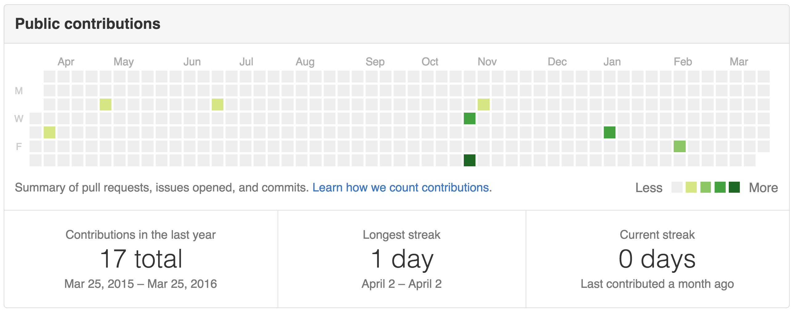

^ My favourite is the github contribution graph. Look at that. I’m such a slacker. Barely contribute anything. Nobody should be hiring me. I’ve never even had a streak. Except that one of those little dots from last year is adding a significant feature to Django, in one pull request and one commit. And there are so many other ways to contribute outside of Github. And to make it even worse, this only includes my public repos.

—

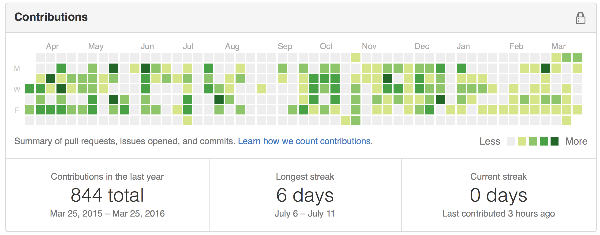

^ Which give a completely skewed image, because this is the one with my private repos. That includes all my work on this talk and on work work. I don’t work much in weekends, which github punishes me for because I have only a very short streak. But that’s just healthy.

^ And that makes this contribution graph, prominently displayed on everyone’s github profile, potentially harmful to the well-being of developers and other contributors. Because it motivates people to keep going even when being helpful doesn’t help them. And it is far from the only thing in our community with this risk.

^ TIME SLIDE END: 19:00

—

^ TIME SLIDE START: 19:00

# [fit] It’s ok to ask
# [fit] for __*help*__

^ I’d like to talk a bit about asking for help. Because asking for help can be hard. Trust us, we know. But it’s always ok to ask for help.

^ https://500px.com/photo/101898767/lighthouse-by-jan-bambach

—

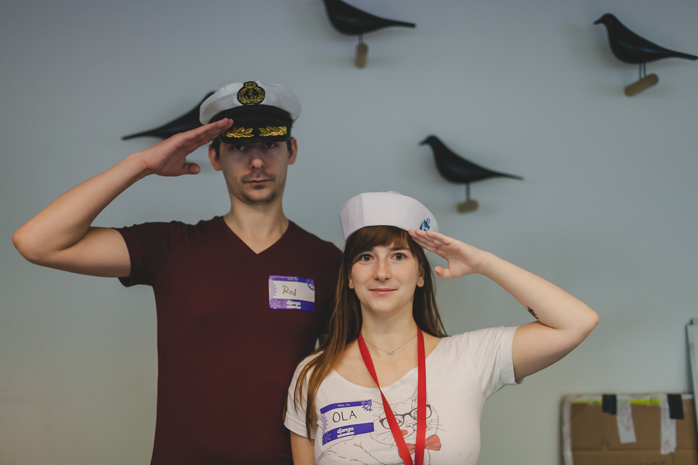

^ Asking for help isn’t just difficult when it comes to well-being. At sprints, like the one this weekend, people can be hesitant to ask for help with whatever they’re working on. Especially people that are shy, new to the community, or even are socially anxious. Someone might be so hesitant to ask that nobody helps when they’re stuck.

^ So at the Django Under the Hood sprints last year, we told people that if you see anyone with a sailor hat, you may grab them at any time to ask anything. You are not disturbing them. They will not think you’re silly for asking that question. They may or may not know the answer, but they will help you find the answer.

^ This works great because people with questions know the hat people explicitly want to be disturbed and asked, and it also works for me as an organiser because sometimes being helpful doesn’t help me. I might be busy with other things or too tired. But then I can just take my hat off when I can’t help anyone right now.

^ https://www.flickr.com/photos/137962885@N08/23048789940/

—

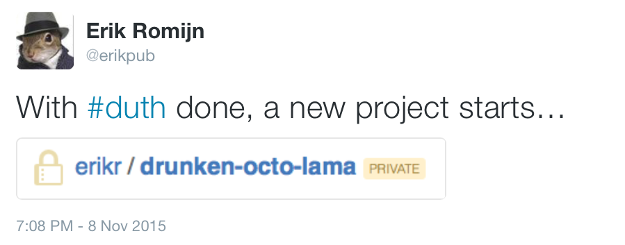

^ When I first started thinking about this talk, about 11 months ago, my ideas were very incomplete. I had some really good ideas, some of which survived until today. But it just wasn’t enough. It felt like things were missing, and I wasn’t sure what they were. And I just couldn’t fill in the missing parts.

^ Around 10 months ago, I met Mikey for the first time at Jezdezcon and we very quickly became friends. I was still struggling with the talk when at some point I mailed Mikey and said

^ “I have this half-assed idea for a talk. It’s full of holes, and this is either my best or my worst idea ever for a talk. Anyways, here are some random incoherent ideas. I don’t think I can do this on my own and it’s also pretty terrifying, so maybe you’d like to join me to build a talk out of this together.”

^ And so we started the real work just after Django Under the Hood, in our secret github repo. You can imagine how relieved I was when we got the acceptance mail for Djangocon in late January.

—

# [fit] Asking for help __*is not*__
# [fit] the same as **failing**

^ So what it comes down to is: if I hadn’t asked Mikey for help to work with me on this talk, it would never have happened and I would not be on this stage.

^ Sometimes asking for help feels like failing. Like admitting you can’t do it on our own. Whether it’s a talk you’re trying to build, a conference to organise, a new feature in Django, or how to deal better with workplace stress. With feeling unwelcome in this community due to your social anxiety. Or needing a lot of quiet time because being around a lot of people just very quickly exhausts you.

^ Asking for help does mean admitting you have difficulty doing something alone. But that’s not failing. It’s the opposite. If I would try to organise a conference on my own, I imagine it might literally kill me. So either I do it with others, and regularly ask for help and offer help, because otherwise there is no conference. If I would try to do this talk on my own, it would never have happened. It would only have failed if I hadn’t asked Mikey to do this with me.

—

^ When we struggle with things, it’s tempting to pretend they don’t exist. It means we don’t have to deal with them. Whether your issues you are just struggling with self-esteem, or whether have more serious well-being issues that require professional care, asking for help can be hard because it can make things seem more real and it’s tempting to stick your head in the sand. It’s not uncommon for people to do that for years, like Russell told us last year. 

^ But you do not become depressed when you go to a professional. Your panic attacks were real even while you hid it successfully from everyone. And whether it qualifies for a diagnosis or not, the stress will be affecting you just as much. If you are not well, and it is impacting your life, those issues are real. They are real whether you talk to your friends or not, whether you take action or not, whether you seek professional help or not.

^ What you’re doing when you ask for help is not making your issues more real than before, but taking responsibility for helping yourself. Because it’s ok to ask for help.

—

# [fit] ‘But it doesn’t make any sense :disappointed:’

^ When you’re suffering from well-being issues, it may occur to you that some of your issues don’t make any sense. This can be incredibly confusing and frustrating. It can make you feel like you don’t deserve help. Like it’s all in your head (it is though) and you just need to think your way out. It just feels silly.

^ For example: Everything in your life might be going great. So it doesn’t make any sense to feel sad. But still you do. Your workload might not be that high objectively. So it doesn’t make sense to lose sleep over stress. But still you do. You have friends and people generally seem to like you. So it doesn’t make sense that you feel inferior and out of place. But still you do.

^ To ask for help, your feelings don’t have to make sense. Our minds often do not behave rationally. Your struggles don’t have to be rational, and often they’re not. What makes it ok to ask is that you are experiencing them and they are affecting your life.

—

### It’s __*not ok*__ for someone to make fun of you or ridicule you when you ask for help.
^ Asking for help can also be terrifying because you’re afraid others might judge you. That they might make fun of you, or ridicule you. When I asked Mikey to work with me on this talk, she could have said it was a terrible idea and I was an idiot for even thinking it might work. But that is incredibly rare in my experience, and such things have never happened to me personally in this community.

^ However, if you reach out for help, and someone does makes fun of you or ridicules you, or just claims you’re being overly dramatic, it still wasn’t wrong of you to ask. It just means that person is toxic, and not really your friend. It may also be a violation of the code of conduct, so please report it. Mikey and I aren’t code of conduct contacts, but feel free to reach out to us too.

—

### Feel free to ask us for help.
### But we might say __*no*__, because it’s also ok to say no.

^ In general, feel free to reach out for help to us at any time. However, we can’t promise we can help you right there and then, or even at all. We try to always put our own well-being first, and encourage you to do so too.

^ While building this talk, we had a bunch of ideas that didn’t make it, because it was just too much. And we’ve constantly tried to keep a check on each others well-being throughout our work on this. It’s ok to ask for help, but it’s also ok to say no, because sometimes being helpful doesn’t help you. Respectfully and politely, but still no.

—

# [fit] It’s ok to ask for help
# [fit] because we are a
# [fit] **community**

^ I honestly have no idea how often I have and will ask for help. From my friends, from my peers in this community. Sometimes with code. Sometimes with organising something. Developing an idea. Or when I’m not feeling well.

^ I can tell you that, even after everything I’ve just told you about why it’s ok, which are all things I strongly believe in, asking for help is still hard sometimes. Even while I know it’s not failing. Even while I know it’s ok when something I feel doesn’t make sense for me, and even while I know that person is happy I asked.

^ But I’ve almost never regretted it and it’s almost always been a great relief. So don’t expect that asking for help will suddenly become easy. But when in doubt, try to push yourself to open up.

^ And this community in particular is a great place to do this. It is full of some of the most positive and caring people I have ever met. And that makes it one of the best places to ask for help. So here’s Mikey again to talk more about helping and community.

^ TIME SLIDE END: 26:30

—

^ TIME SLIDE START: 26:30

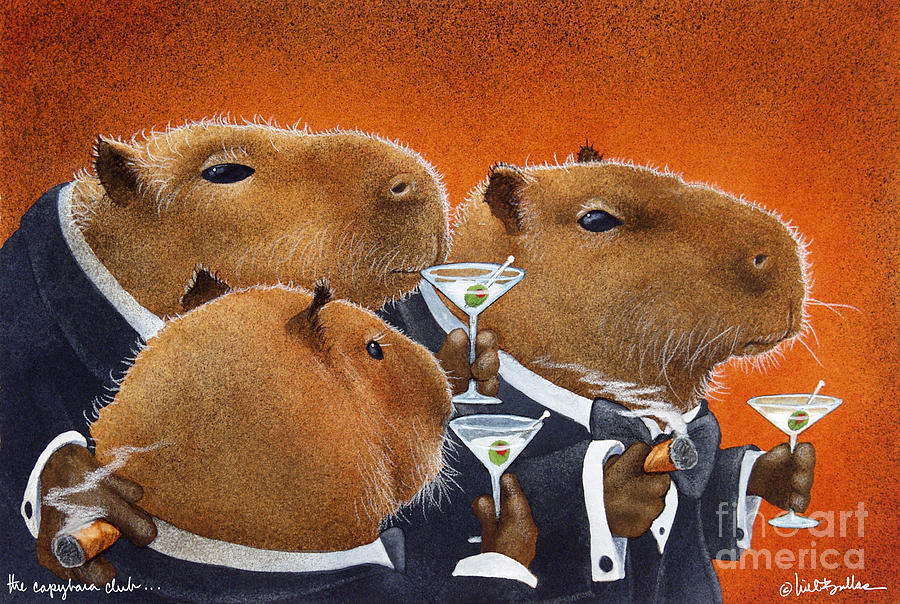

# [fit] Help __*us*__ to help __*you*__
# [fit] to help **others**

^ So far we focused on how individuals can help themselves or others, but now I'd like to talk about how the community as a social and professional entity can provide support to its members.

^ As a collective, the Django community is paving the way with many initiatives and officially-endorsed activities that lead to positive impact on the ongoing productivity and well-being of the contributors, which makes the community as a whole more healthy.

^ There are good examples of this in our community already, which I will briefly walk through to acknowledge the efforts being made by a lot of great people in this space.

—

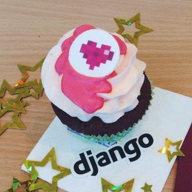

## Django Fellowship Program

## Django Girls Outreach

## Counseling at DjangoCon Europe

^ The Django Fellow Program is a great example of how the community created a paid position, directly supported and funded by the community, where the fellow takes on important tasks without having the additional burden of another full-time job. This also means that the unpaid contributors can focus their time on parts they enjoy more, and reduces the risk of their own burnout.

^ Of course, the Django Girls outreach programme couldn't have been so successful if it wasn't for the overwhelmingly-positive attitude of the organizers and mentors, which made a huge difference in how newcomers perceive and how they're received in the Python and Django communities, which again makes the communities healthier and happier as a whole. 

^ And like Erik mentioned, having counselors at DjangoCon Europe was a more direct step to reach out to the community members and invite them to talk about their thoughts and feelings. Unfortunately, providing professional counseling on an ongoing basis is not something that most open-source projects can support, but that's not always what's needed.

—

^ If you've been paying attention to the internet recently, you might have seen this very sweet and very powerful comic called “how to care for a sad person”, which basically shows how you can support someone in need without trying to “fix” the immediate problem.

^ To me this also reinforces the theory that sometimes all we need is someone to understand, not judge, and give us a hug (metaphorically or physically, as appropriate).

^ http://imgur.com/gallery/7fATZ

—

# [fit] How can **we** help?

^ And that is something where the community can make a difference. Where you can make a difference.

^ Like Erik said, there were a lot of ideas that didn’t make it into this talk. But I’m excited to now announce one that did make it…

—

# [fit] Django Software Foundation
# [fit] **Well-Being Committee**[^1]

[^1]: Proof-of-concept accepted by the Django Software Foundation, full implementation in progress.

^ The Django Software Foundation well-being committee. The idea came up when we were trying to think of ways that the community can support members who are struggling as a global, ongoing thing rather than individual p2p thing (i.e. counseling at conferences).

^ Since the DSF cannot, and should not be expected to provide professional help on an ongoing basis, we thought of creating a formalized peer-support network, where Django community members can consult with other community members about anything from work-life balance, burnout, self-esteem, to anxiety, depression, etc.

^ We are still working on working out the exact details of how the committee will function, but we have preliminary approval and support from the DSF board.

—

#### The mission of the well-being committee:

### to provide __*peer support*__ for community members who need to talk to __*someone who understands*__

^ So what is the mission of the well-being committee? Well, to provide peer support for community members who need to talk to someone who understands. 

^ I often find that just the fact that I can talk to other people who experienced some of the struggles that I'm experiencing, especially those who are familiar with tech fields and open-source communities, can be a great relief for me.

—

# [fit] __*Peer support*__ means support
# [fit] by people just like **you**

^ What do we mean when we say "peer support? Well, if you think of "big brother/sister"-style mentorship programs, or some recovery communities like Alcoholics Anonymous, it's very similiar. 

^ Basically, the committee should provide a baseline communication channel that anyone in the community can use if they need to express their thoughts and feelings in a safe environment. 

^ What we're hoping is to help folks get past some of their initial fears (remember how nobody understands you and your problems don't make sense?), and if needed, help them take the step towards professional care.

^ How this will work is that you can send us an email with your questions or concerns, something like “support request”, and the incoming messages will be triaged and taken up by one or more committee members with relevant background/experience.

—

### Stress management
### Depression
### Anxiety
### Work-life balance
### Relationships
### Self-esteem & identity
### LGBTQIA+
### ......

^ What sort of topics can you talk to us about? Here are a few examples that are based on the DjangoCon Europe counseling themes, but of course this isn't an exhaustive list. 

^ so for example, if a community member is facing anxiety issues, they can be assigned to a committee member who can provide peer support in that area.

—

### Erik Romijn Mikey Ariel Daniele Procida <__*YOUR NAME HERE*__>

#### (volunteer responsibly, don't forget your oxygen mask!)

^ At the moment, the committee will include Erik and myself, with Daniele Procida who will help us get started on behalf of the DSF board.

^ At this point we'd like to put out a call for any people who are interested in exploring this yet-unknown territory of formalized peer support.

^ Just remember that this committee is set up in order to *help* the community with well-being issues, not *create* more well-being issues, so please consider your own well-being before you sign up, and if you are unsure, just ask us.

—

# :warning:
# [fit] __*Peer*__ support cannot replace
# [fit] **professional** support

^ Also, please keep in mind that this peer-support network is not a substitute for professional help, and care must be taken to guard the well-being of the committee members themselves. This means that if we cannot help you, we will let you know, respectfully.

—

^ But you don't need to be a health care professional to help someone feel like a happy little sushi roll, and that's what we're aiming to try and push forward with this project.

^ http://imgur.com/gallery/7fATZ

^ TIME SLIDE END: 33:30

—

^ TIME SLIDE START: 33:30

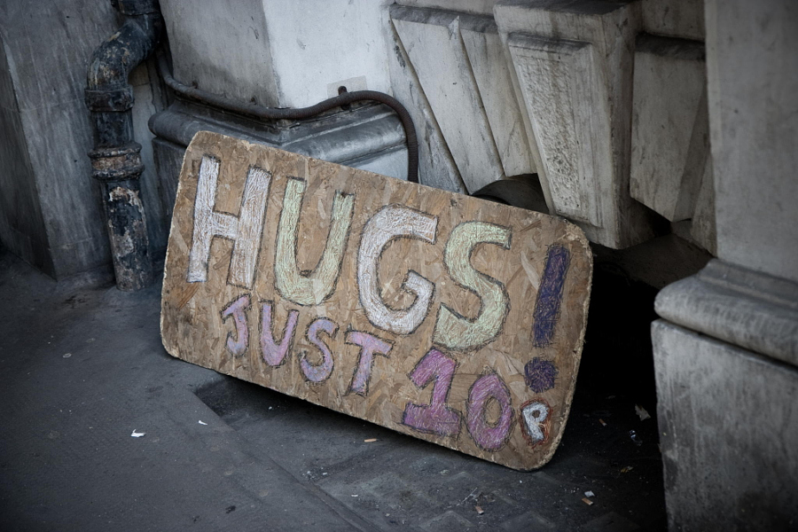

# [fit] We are more **loved**
# [fit] than we think

^ We said before that no matter what you’re struggling with, that doesn’t make you less lovable. But in general, most people don’t feel as loved as they actually are.

^ https://500px.com/photo/34094052/sign-of-affection-by-tom-page

—

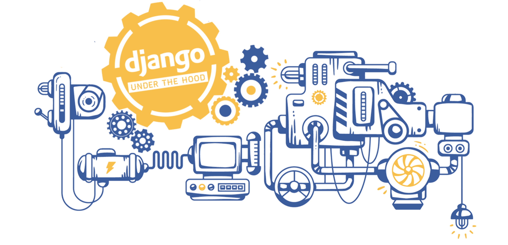

^ I’m one of the organisers on Django Under the Hood, an in-depth Django conference in Amsterdam with 300 attendees. My main task is everything which involves dealing with Dutch people.

^ As a number of people in this room can tell you, organising conferences, especially with a volunteer team, can be incredibly stressful. There’s venues, speakers, sponsors, tickets, budgets, foods, parties, hotels, flights, communication on websites and social media, artwork, posters, attendee support, code of conduct and much more. There are always things that almost go wrong during the conference, that are quickly fixed behind the scenes.

^ Conferences are fairly short, and I’m doing this with an amazing team. So as stressful as it is, I feel like I can deal with it. And when I can’t, I feel like it’s ok to ask for help, and it’s ok to step back.

^ Most of all the stress organising conferences involves and effort it requires, and all the things that almost went horribly wrong, are all worth it for me and probably many other organisers, when I get an email from an attendee like this:

—

__*’I feel totally overwhelmed, surprised and very, very grateful. Thank you for caring. You are unbelievable. You are a bunch of craziest, the most positive people I've met. You inspire me to give back to community even more. I wish I could express properly what I'm feeling right now...*__

__*May it always rain stroopwafels on you. But not all the time, that could be inconvenient. Only when you feel like having stroopwafels. Or someone that you like feels like having stroopwafels. Or you just want to make it rain stroopwafels.*__

__*Sending hugs, you crazy, amazing people!’*__

^ [read out text]

^ We got this mail from an attendee which we were able to help with a problem they ran into.

^ And this wasn’t the only email or tweet like this. Being able to make people feel like this, is why I love organising Django Under the Hood.

^ If you’ve ever organised events, or worked in other fast high-stress situations, you might know that the team is everything. It is so important to feel like you can ask for help or step back. Even if you don’t have to. Because ...

—

# [fit] We are loved **even** when we
# [fit] need help or need to step back

^ Even when you need help, when you need to step back, even when you sometimes flake, even when you make mistakes, you are probably much more appreciated than you think. This community is full of friends that are loving, caring and supportive. That's why I am still here. And almost all of us sometimes flake and we all make mistakes. And our community is here to support us when that happens.

—

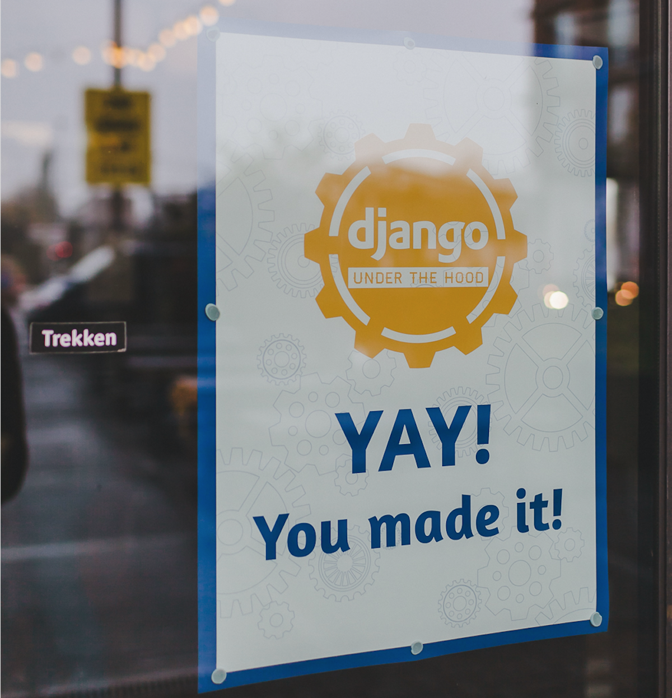

^ In the Django community, we already do great work in that area, by creating a positive atmosphere in which everyone feels great. With posters that make people feel just a bit more welcome. With a slack channel so that attendees can talk even before the conference start and make plans to do things together, which especially makes a difference to people that are more shy and/or come alone.

^ We try hard to make everyone feel like they’re a part of this community, and that we’re delighted to have them with us.

^ https://www.flickr.com/photos/137962885@N08/23069890796/

—

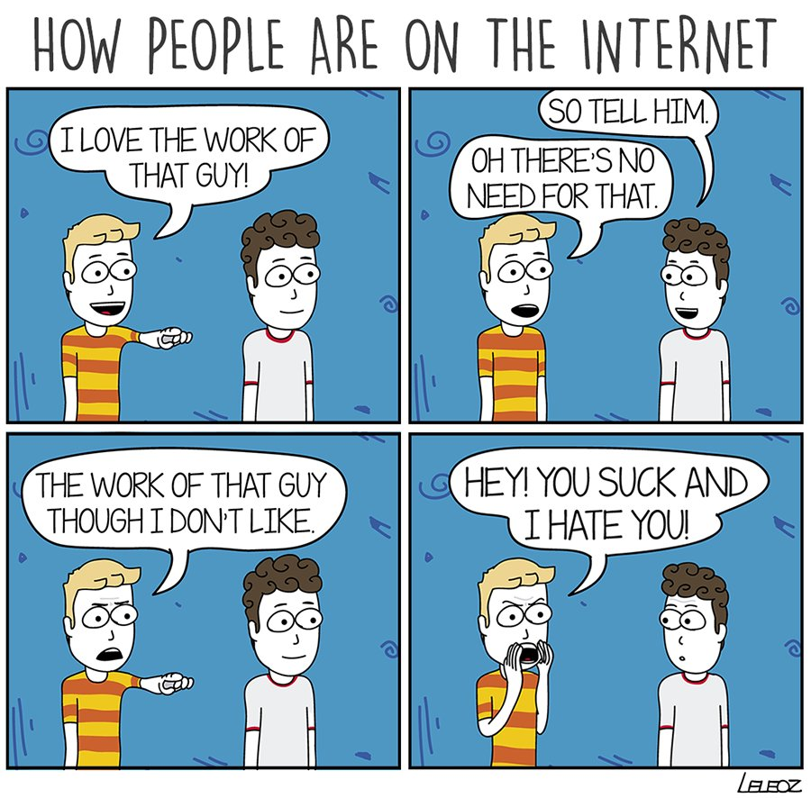

^ Unfortunately, the reality is too often still like this.

^ But the feeling that you made a difference, that your work matters and and has value, and that the people that you work with happy to work with you, is an awesome feeling. And not just an awesome feeling, but an important feeling as well. It helps us feel like we matter, that we’ve made a positive change, and that people care. It gives energy.

^ Whether it’s code, supporting the DSF, helping to build small or large events or anything else. These feelings can all have substantial effects on people struggling with self-esteem, burnout or anxiety, or anyone leaning towards those. Which applies to so many of us.

^ I can certainly say that for me, seeing emails and tweets like the one I read out makes a huge difference, and we feel our community would be an even better place if there would be more of that. Because even we don’t always let people know how much we care about them. Therefore, I’m proud to introduce to you the second project that made it...

^ https://twitter.com/happymonday_com/status/707628776184750080

—

^ Open-source Happiness Packets!

^ The thing is, openly expressing appreciation, gratitude, or happiness to other people can be difficult. This is especially true when you don’t know them very well. Many of us come from cultures in which people are not open by default about such feelings, and naturally feel uncomfortable or even creepy to share them.

—

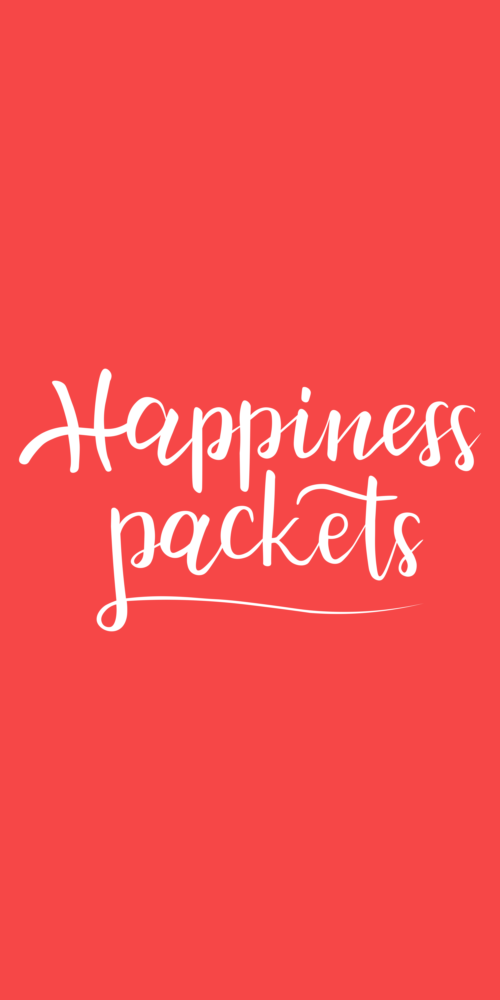

# [fit] happinesspackets.io     @happinesspacket

^ Open-Source Happiness Packets is a very simple platform to anonymously reach out to the people that you appreciate or to whom you are thankful in your open-source community. Your message can be sent anonymously if you prefer, but of course, we encourage you to share your name, but it's completely optional!

^ We’re tremendously excited to see where this will go and where we can take this together. We’re fairly sure everyone in this room has someone in this community that they are grateful too or admire, and we’d like to ask you to send a happiness packet to two or more of them before the end of the conference. We know it can feel a little awkward at first, but we’re sure you’ll make a big difference to both yourself and who you’re sending it to.

—

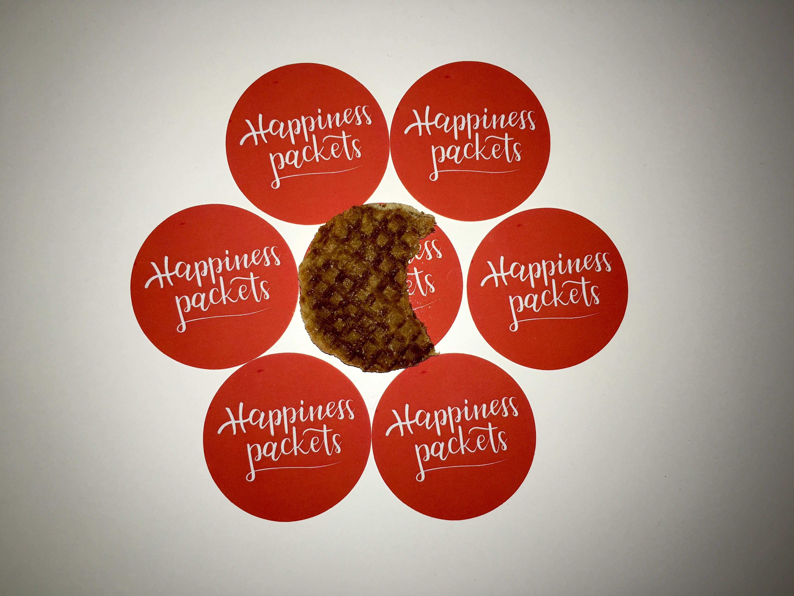

^ Also, we have stickers! A lot of stickers. Find me or Mikey for them. And they’re an exact fit to the mini stroopwafels I brought with me, but the stickers are not edible. And most of all don’t forget to send some happiness packets yourself!

^ TIME SLIDE END: 40:00

—

# [fit] Yay!
## __*We made it!*__

^ [MIKEY]

^ https://500px.com/photo/95591087/roar-by-greg-francke

—

# Our thanks go out to

## Russell Keith-Magee Amber Brown Ola Sitarska Daniele Procida

__*And to many others from our community and our friends for knowingly or unknowlingly contributing to our work.*__

^ [MIKEY]

^ This talk would not have been possible withut the help of Russell Keith-Magee and Amber Brown, who we interviewed as part of our research. 

^ Ola Sitarska built the entire design for Happiness Packets. 

^ Daniele Procida from the DSF board for helping us get started with the well-being committee. 

^ The organisers of DjangoCon for giving us the space to talk to you about this.

^ And of course there are many others among our community and our friends that in some way helped inspire us or helped us build this talk and the projects we’ve announced.

—

## Happiness Packets
### www.happinesspackets.io
### @happinesspacket[^*]

[^*]: __*@happinesspackets was too long for a twitter username :disappointed:*__

^ [ERIK]

^ So, send your own Happiness Packet on happinesspackets.io. We’re also on twitter as @happinesspacket. Because @happinesspackets is too long for a twitter username.

—

# [fit] Django Software Foundation
# [fit] **Well-Being Committee**
# [fit] well-being__*@*__erik.io

^ [MIKEY]

^ And please send us an email if you want to join the well-being committee and help us build this support network. At this time we cannot accept support requests yet, because we have some foundational work to do, but look out for an announcement from the DSF board when the committee can be open for business.

—

# [fit] github.com__*/*__erikr__*/*__well-being

^ [ERIK]

^ We found quite a few resources while working on this. Not nearly all of them made it into this talk. But, we have a GitHub repo that lists all our public resources and we hope that will grow into a wider collection of resources around well-being. This repository also has all our slides.

—

# [fit] Code of Kindness      No on-stage Q&A

^ [MIKEY]

^ Once again, we'd like to remind you to handle whatever is shared with you with care, be kind to the folks around you, and come to ask us questions during the break or any time later! You’ll find us in the music library upstairs.

^ Also, if you have other ideas around well-being and community, we’re happy to talk about them any time.

—

^ TIME ENDING: 42:00

## **Thank you!**

### Erik Romijn __*@*__erikpub Mikey Ariel __*@*__ThatDocsLady
### __*@*__happinesspacket well-being__*@*__erik.io
