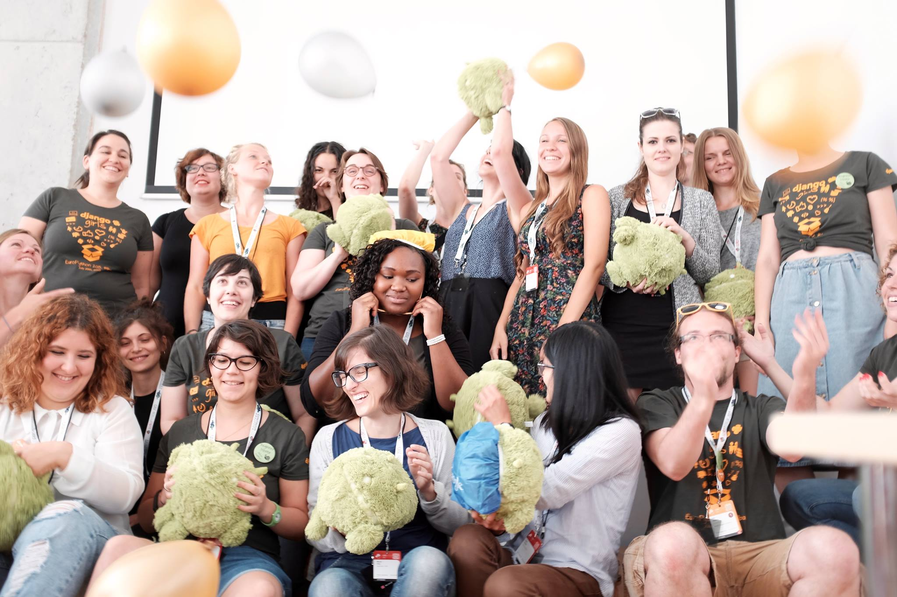
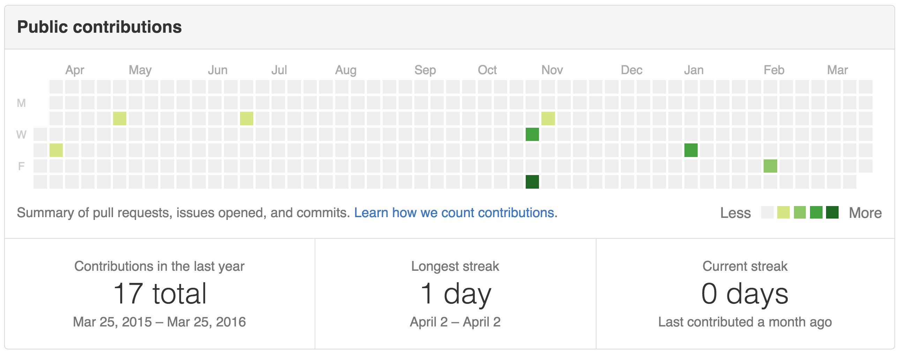
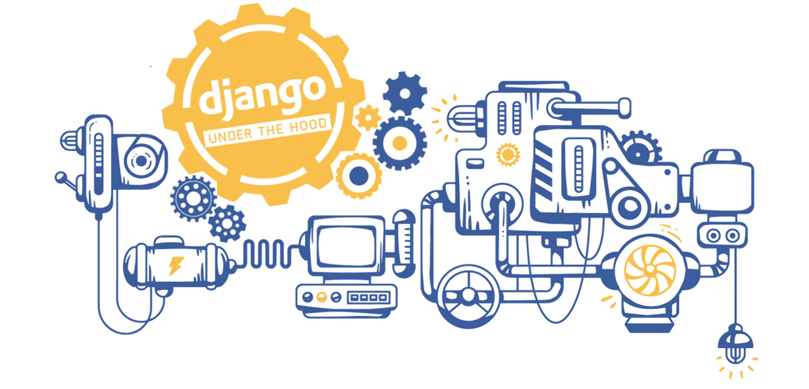
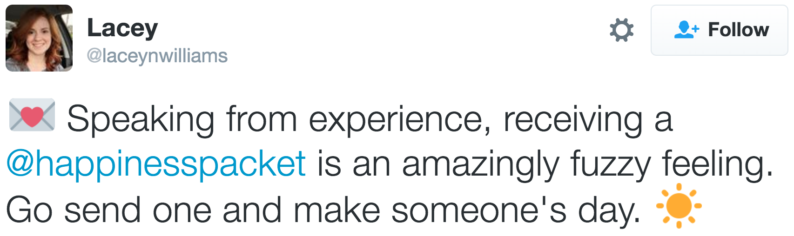
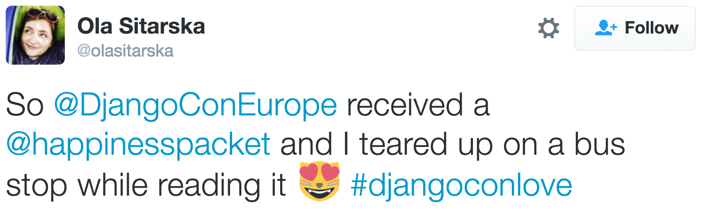
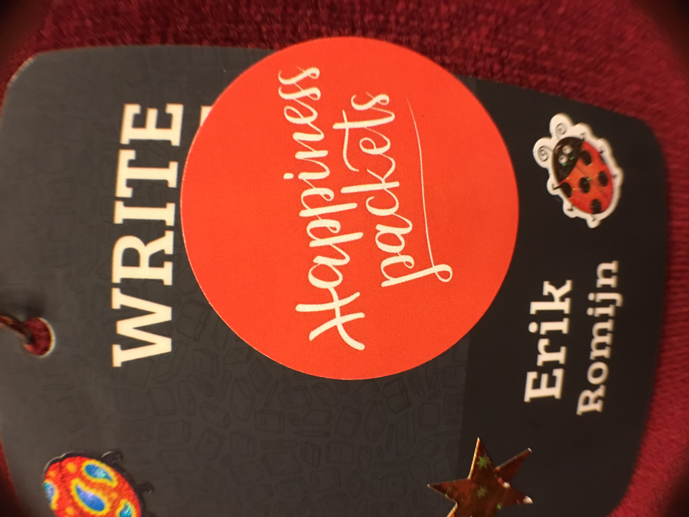

footer: @erikpub
autoscale: true

—

# [fit] Healthy Minds **in a**
# [fit] Healthy Community

### Erik Romijn *@*erikpub

#### **Write the Docs, September 2016**

^ Hello everyone, very happy to be here in this wonderful community. When Mikey first suggested I come to this conference called Ride the Ducks I was a little confused…

—

^ but fortunately we cleared that up pretty quickly.

—

# Who am I?

### Erik Romijn *@*erikpub
### Mikey Ariel *@*ThatDocsLady

^ I’m Erik and you may also know me as the shipit squirrel on slack. I spend most of my time as a developer and am co-founder of a small company that helps governments manage healthcare and sometimes sponsors conferences with gongs. I do a lot with Python and Django, being a Django core developer, chair of the Dutch Django Association and co-organiser of various conferences.

^ And I also want to mention my co-author and co-presenter on earlier versions of this talk, my dear friend Mikey Ariel. Building this talk together was a journey that I’ll be coming back to a few times, and it really would not have existed without her.

—

# [fit] Code of
# [fit] Kindness

^ This talk has a mix of stories from myself, Mikey, and many other open source community members and friends that have shared their stories with us. I’d like ask you to keep in mind that the point of this talk is to help trust and openness.

^ We’re going to be touching some sensitive issues and there may be some personal conversations after this talk about these subjects by people who might not have had the courage to discuss them before. Therefore I’d like to ask you to handle whatever is shared with care, during and after the talk.

^ TIME SLIDE END: 2:00

—

^ TIME SLIDE START: 2:00

# [fit] _None of us are_
# [fit] _**alone**_

^ I’d first like to talk about why none of us are alone. With many people I meet, it often feels like they pretty much have their entire life together. They tell me about their wonderful work, they seem to get along with everyone instantly, have a ton of friends and they’re always doing something awesome with awesome people. It seems entirely smooth sailing for them. 

^ However, over the years I’ve found that when I get to know some of these people better, they sometimes open up and I find out how wrong I was.

^ https://flic.kr/p/w1W6ps

—

^ Because I’ve found that for many of the people that I admired the most and sometimes even envied, the people that seemed to have everything together more than anyone else I know, I was wrong. 

^ When they open up to me, there are stories of depression, crippling anxiety, OCD, PTSD, or even self-harm. I have felt completely blindsided again and again about how serious these stories sometimes are. And even more impressed by what these people accomplish regardless. 

^ It’s left me increasingly thinking that I probably know very few people that have never struggled with their well-being, but that many of them simply haven’t felt comfortable enough to be open about it yet. And they don’t have to if they don’t want to, of course. 

^ This has taught me that no matter how successful someone may appear, and how amazing their work is or how their creativity seems boundless, they may very well be spending tremendous amounts of energy just to get through daily life.

^ And this isn’t uncommon...

—

# [fit] **1 in 4**
# [fit] experience mental illness in their lifetime

^ … because around one in four will experience mental illness in their lifetime. That could be something that’s present your entire life and already affects you now, like a development disorder, or something that surfaces later, like burnout or OCD. 

^ Once it shows, it might affect the rest of your life, or it might be resolved within a few years. But 50 people in this room have or will go through such an experience in their lifetime.

^ That’s still quite a minority. But many people struggle with their well-being without necessarily meeting the criteria for a diagnosis of a mental illness.

—

# [fit] **70%**
# [fit] regularly experiences physical symptoms due to stress

^ For example, in office workers, 70% regularly experiences physical symptoms due to stress. That means their stress level is regularly so high, that it results in being excessively tired, having head and neck pain or other problems. That may not meet the bar for a mental illness diagnosis, but in the long term, such high stress levels are harmful.

^ So even though a minority might experience a mental illness, a large majority will or is already suffering from issues that affect their well-being and have an impact on their life.

—

# [fit] ‘I’m fine, I’m
# [fit] just **tired**...’

^ However, hiding issues, especially in our mental well-being, is ingrained into many of our cultures. The reality of it is though:

—

# [fit] There are other people **in this room**
# [fit] with similar struggles.

^ I know that there are people in our community that are struggling. Sometimes a lot, sometimes a little. I know some of these people and have heard their stories, but not nearly all of them. It’s left me convinced that if you’re struggling, there are very likely to be other people in this room that know exactly how you feel, and understand.

^ There are a bunch of people in this room that suffer from depression. People with low self-esteem. A history of eating disorders. Social anxiety. Self-identity issues.

^ And there are even more people that may not struggle in the same ways as you, but that also understand, because they know what it’s like. I don’t know who exactly all these people are. But I know they’re here.

—

# [fit] **1 in 10**
# [fit] DjangoCon Europe 2015 attendees spoke to a _counselor_

^ At DjangoCon Europe 2015, free confidential counseling sessions were available to all attendees. One in ten attendees used this service. You could just take a post-it with a timeslot from a board, and you’d get 25 minutes with a counselor. We got some anonymised data from these sessions.

^ 25 minutes is not enough to resolve serious issues, but it can help to set people on a path to feeling better. I speak from personal experience. Sometimes with self-care, sometimes suggesting professional care, sometimes a mix of both.

—

### _**”It’s been a relief to finally say these things to someone and have acknowledgment of the problem.”**_

### **”I found it useful and relaxed and feel like I am not crazy or alone. This is normal!”**

^ My two favourite bits of feedback from the well-being sessions were: [read text]

^ They reflect well how people generally felt about the sessions. Not an immediate fix to all your problems. But a place to say things out loud and not be afraid of being judged. To feel validated and acknowledged that your problems are real, even when they might not be the same or might not be as serious as those of other people. 

^ This is also what we’re trying to do here today.

—

# [fit] We’re not mental health professionals
# [fit] but we **can** make a difference

^ I am not a trained mental health professional. I am neither trained nor professional.

^ So I can't treat your eating disorder. After this talk, and despite all the other work we’re doing, anxiety will still be there. The stress or insecurities won’t be gone. But like short counseling sessions, even though we’re not professionals, we *can* make a difference.

^ That we includes you. That includes all of our community. Every single one of us. By being considerate, empathic, accepting and understanding. And, for example, help anyone who is struggling feel validated and not alone...

—

# [fit] _None of us are_
# [fit] _**alone**_

^ … because none of us are. Whether you’re struggling with multiple complicated serious disorders, or just feel like sometimes the stress is taking a toll on you. Our struggles are valid because they’re impacting our lives. Know that whatever you’re struggling with, you aren’t crazy, you aren’t any less lovable, and most of all, you’re not alone in the community.

^ TIME SLIDE END: 7:30

—

^ TIME SLIDE START: 7:30

# [fit] _help **yourself**…_

^ So now that we know we're not the only ones struggling and that we're not suffering from unicorn problems, let’s talk about the first steps that we can do to help ourselves out of whatever is troubling us. Because the last thing many of us ever want to do is admit that we’re struggling. That we can be overwhelmed. That we’re not a superhuman. 

^ But how can we end up overwhelmed? Many of us are mostly responsible, functioning adults, and yet it’s easy to end up in a situation where we’re constantl fighting against ourselves to balance all the work tasks, projects, conferences, hobbies, friends, and sleep.

^ You are probably generally liked, people value your contributions and your company, and many contributors get a lot of satisfaction from participating in projects for the greater community.

^ And that is exactly where the problem starts. Because somewhere along the way we might forget that we need to help ourselves…

^ https://500px.com/photo/134275491/help-by-habibullah-al-mahmud

—

# [fit] _... **before** you_
# [fit] _help **others**_

^ ... before we can help anyone else. Whether it's excitement about a potential project, an invitation to speak at or organise a conference, or a workplace increasing the workload because “you’re a rockstar who can do everything", it’s so easy to get caught up in a desire to contribute, to help, to be a part of something, that we lose control over our time, energy, and mental resources.

—

# [fit] When being **helpful**
# [fit] doesn't help **you**

^ And that's where things get dangerous. When I forget that in the end, participation is supposed to create a positive impact not just on my peers, community, or world, but most of all on ME, when I forget that, being helpful doesn't help me.

^ If this sounds selfish to you, consider that putting yourself first is not always selfish, and sometimes it might even save lives.

—

^ If you've flown before you might remember the safety instructions for putting your oxygen mask on in case of loss of cabin pressure, and only after putting on your own mask, you should help others who might need assistance.

^ This is because if the person who needs your help passes out from lack of oxygen, there's still time to help them. But if you try to help them first and you run out of oxygen yourself, you both pass out and nobody can help anyone. 

^ In other words, if you take care of your own well-being first, you can still help others. But if you forget to take care of yourself and first focus on others, you might run out of air before you can help them. 

^ https://lifefitnessbydane.com/2015/10/21/mother-or-martyr/

—

# [fit] It's ok to say **no**
# [fit] * and it's even ok to say **no more**

^ I am also at risk of over-commitment, because I either get excited about things and want to participate, or I'm invited to participate and I feel valuable and validated for it. And that makes it hard to turn down project offers or to step down from projects that I already joined.

^ But why is it so hard for us to say “no” to a potential project? And why is it even harder to say "no more" when we need to step down from a project?

^ From my own experience and from what we discussed with others, there are two main reasons for this: we are afraid that if we turn down or step down, it means that we failed, or that people will respond in a negative way. 

^ So how can we address these fears and gain the needed confidence to make these decisions?

—

# [fit] Sustainable
# [fit] Open-Source(_rer_)

^ When I asked Mikey to help me build and present the first version of talk, she’d just changed careers (for the third time), moved cities, shifted from office work to home-office, and had about a million projects going.

^ At some point I confronted Mikey with, according to her own words, what she should have confronted myself with - she was dropping the ball on the stuff that she promised to do for the talk, and she was risking the whole collaboration because she tried to juggle too many things.

^ Fortunately, we are dear friends and this talk is about well-being, so the conversation was positive and productive and Mikey was able to admit that she had a problem. She then had to look at all the things she had going on, and make a hard decision - what to let go of. To my joy, she prioritised this talk, but it certainly wasn’t easy.

^ We must remember that sustainability isn't important only for our open-source projects, but to the open-sourcerer too. This might be simpler than you think: if I burn out I am more or less useless to myself and others, so I can't let short-term satisfaction or validation, from myself or others, impact my long-term capacity.

—

^ So now you looked at your project commitments, at your free time (what's left of it) and you realised that you really must balance your life better. Now you need to communicate this to your peers, which brings us to the second reason why saying “no” or “no more” is hard: what will people think?

^ Unfortunately, even after you admit to yourself that you need to trim down on your commitments, the next step of actually communicating this to your project peers or to the community can seem like an even bigger hurdle. Especially if you’re a veteran contributor, you might feel "the project might fail if you leave" and “you can't let the community down". 

—

# [fit] What you do _≠_ Who you are

^ Humans are social creatures, and most of us work at jobs without a clear “finish line”, so ongoing, always-developing, never “done”. This means that we're constantly dependent on subjective feedback from our peers, and if we combine this with a culture that encourages over-achievement and over-commitment, no wonder we're sometimes terrified of saying “no” or “no more”.

^ When I wrote Mikey about my grave concerns, that was not an easy email to write. I was most unhappy with how things were going at that time. I was certainly annoyed with the lack of progress. But I also know her quite well, and care deeply for her, and I was sure that she didn’t do this because she didn’t care about me or our project. Because what we do isn’t who we are.

—

# [fit] **Suffering**
# [fit] through our work
# [fit] serves **nobody**

^ A community of volunteer contributors, be it thousands of people on an open-source project, or two people on a talk, means that nobody HAS to do anything. We WANT to contribute, we get (and give) immense value doing it, but this is all “at-will”, even more so than our jobs.

^ If we suffer through projects, conferences, or responsibilities, if we had let this talk damage our own well-being, then there is no love in the creative process, and we're not serving anyone, least of all ourselves.

—

# [fit] The fear of the **unknown**

^ When you feel like you need to step down from something, it’s easy to come up with so many imaginary scenarios of how people will not understand or accept you choosing for yourself. But in reality I’ve only heard stories of it being met with kindness and understanding. Our fear of the unknown will almost always be more destructive than the consequences of our actions.  And even if some people are offended or respond badly to this step, it's usually indicative of their own fears or insecurities as they will need to make adjustments too.

^ If we accept that we can only be helpful if we can retain our health and balance, then we can face our peers with confidence that our action won't just help us, but also help the project or community because it will make space for someone else to step in. Staying in roles we can not fulfil is as if I am licking the stroopwafel, but not eating it: there is no space for others, but I’m not doing it either, and I’d only be harming the project and myself.

—

# [fit] :tada: :scream:

^ I had a personal experience just a month ago. I’m the co-organiser of Django Under the Hood, one of the two large European Django conferences, and as it’s in Amsterdam, my task is basically dealing with Dutch people. That means hotels, food, venue, legal, visas and also the conference party.

^ Setting up the conference party wasn’t going too smoothly, as we also had a limited budget, and I was not managing it well. My co-organisers reminded me about it a few times, and I got increasingly stressed out about it, but I felt like I would be burdening my friends if I dropped it. But what I was really doing was licking the cookie: I wasn’t making the party happen, but by insisting I would, there was no space for someone else to do it.

—

^ So I told my friends that I needed help with this, because I just don’t feel like I have a handle on it and it just feels exhausting. And if we need someone to hop over to a venue to see it in real life, I could still do that.

^ And although that was not an easy thing to do, my fellow organisers responded as you would hope: immediately supportive, and ready to help out. Your own imagination of how others will respond is almost always worse than reality.

—

^ So please - put your oxygen masks on first, otherwise you'll run out of air before you can help anybody else. Whether it's taking a moment to think about if you want to join a potential project, or taking a few moments to figure out which project is draining your energy and needs to be let go, don't let your fears paralyse you from taking care of yourself.

—

# [fit] This might sound easy but many things push us towards
# [fit] **overcommitment**

^ All this sounds a lot easier than it is in practice. There are many patterns in our and other communities that tend to push us towards over-commitment. And for long-term well-being of everyone in the community, it’s important we recognise and tackle these.

—

^ My favourite is the github contribution graph as it used to be until a few months ago. Look at that. I’m such a slacker. Barely contribute anything. Nobody should be hiring me. I’ve never even had a streak. Except that one of those little dots from last year is adding a significant feature to Django, in one pull request and one commit. And there are so many other ways to contribute outside of Github. And to make it even worse, this only includes my public repos.

^ Fortunately, GitHub recognised this and they removed the streak counter recently. There is also now an option to show private contributions as well. 

^ Some people got really upset about me campaigning for removing this, as my issue about it made #1 hackernews. My favourite reactions included someone ranting about how the vocal microscopic minority was being oppressive, how the graph was important to show who was dedicated to true mastery and this is all part of the leftist tyranny. And someone called me a neoliberal emotional jihadist.

^ So there’s a lot of work left to be done in this area, and many similar patterns remain in our community.

^ TIME SLIDE END: 18:00

—

^ TIME SLIDE START: 18:00

# [fit] _It’s ok to ask_
# [fit] _for **help**_

^ I’d like to talk a bit about asking for help. Because asking for help can be hard. Trust us, we know. But it’s always ok to ask for help.

^ https://500px.com/photo/101898767/lighthouse-by-jan-bambach

—

^ Asking for help isn’t just difficult when it comes to well-being. Many open source projects like Django have sprints, which are not hackathons, where people often contribute to Django for the first time. People can be hesitant to ask for help with whatever they’re working on. Especially people that are shy, new to the community, or even are socially anxious. Someone might be so hesitant to ask that nobody helps when they’re stuck, and they have a bad time.

^ So at the sprints last year, we told people that if you see anyone with a sailor hat, you may grab them at any time to ask anything. You are not disturbing them. They will not think you’re silly for asking that question. They may or may not know the answer, but they will help you find the answer.

^ This works great because people with questions know the hat people explicitly want to be disturbed and asked, and it also works for me as an organiser because sometimes being helpful doesn’t help me. I might be busy with other things or too tired. But then I can just take my hat off when I can’t help anyone right now.

^ https://www.flickr.com/photos/137962885@N08/23048789940/

—

^ When I first started thinking about this talk, 1,5 years ago, my ideas were very incomplete. I had some really good ideas, some of which survived until today. But it just wasn’t enough. It felt like things were missing, and I wasn’t sure what they were. And I just couldn’t fill in the missing parts.

^ About a year ago, I met Mikey for the first time and we very quickly became friends. I was still struggling with the talk when at some point I mailed Mikey and said - and I’m pretty much quoting the actual email I sent:

^ “I have this half-assed idea for a talk. It’s full of holes, and this is either my best or my worst idea ever for a talk. Anyways, here are some random incoherent ideas. I don’t think I can do this on my own and it’s also pretty terrifying, so maybe you’d like to join me to build a talk out of this together.”

^ And so we started the real work a few months later, in our appropriately named secret github repo.

—

# [fit] Asking for help **is not**
# [fit] the same as **failing**

^ So what it comes down to is: if I hadn’t asked Mikey for help to work with me on this talk, it would never have happened and I would not be on this stage.

^ Sometimes asking for help feels like failing. Like admitting you can’t do it on our own. Whether it’s a talk you’re trying to build, a conference to organise, a new feature in Django, or how to deal better with workplace stress. With feeling unwelcome in this community due to your social anxiety. Or needing a lot of quiet time because being around a lot of people just very quickly exhausts you.

^ Asking for help does mean admitting you have difficulty doing something alone. But that’s not failing. It’s the opposite. If I would try to organise a conference on my own, I would be concerned it might literally kill me. So either I do it with others, and regularly ask for help and offer help, because otherwise there is no conference. If I would try to do this talk on my own, it would never have happened. It would only have failed if I hadn’t asked Mikey to do this with me.

—

#### (I know ostriches don’t do this)
#  
#  
#  
#  
#  
#  

^ When we struggle with things, it’s tempting to pretend they don’t exist. It means we don’t have to deal with them. Whether your issues you are just struggling with self-esteem, or whether have more serious well-being issues that require professional care, asking for help can be hard because it can make things seem more real and it’s tempting to stick your head in the sand. It’s not uncommon for people to do that for years.

^ But you do not become depressed when you go to a professional. Your panic attacks were real even while you hid it successfully from everyone. And whether it qualifies for a diagnosis or not, the stress will be affecting you just as much. If you are not well, and it is impacting your life, those issues are real. They are real whether you talk to your friends or not, whether you take action or not, whether you seek professional help or not.

^ What you’re doing when you ask for help is not making your issues more real than before, but taking responsibility for helping yourself. Because it’s ok to ask for help.

—

# [fit] ‘But it doesn’t make any sense :disappointed:’

^ When you’re suffering from well-being issues, it may occur to you that some of your issues don’t make any sense. This can be incredibly confusing and frustrating. It can make you feel like you don’t deserve help. Like it’s all in your head (it is though) and you just need to think your way out. It just feels silly.

^ But to ask for help, your feelings don’t have to make sense. Our minds often do not behave rationally. Your struggles don’t have to be rational, and often they’re not. What makes it ok to ask is that you are experiencing them and they are affecting your life.

—

### Others do not know what you need if you do not **ask**

^ And not asking for help is dangerous because it can make you feel like nobody wants to help. But most people aren’t telepathic, so they often do not know what I need. The only way to let them help me with my needs and issues, is if I ask. For example, when I speak at conferences I always ask to schedule me early, because it makes me feel better. And you may find that if you make a habit of asking for what you need, you will be surprised by how much is possible, and how supportive people around you are.

—

### It’s **not ok** for someone to make fun of you or ridicule you when you ask for help

^ Asking for help can also be terrifying because you’re afraid others might judge you. That they might make fun of you, or ridicule you. When I asked Mikey to work with me on this talk, she could have said it was a terrible idea and I was an idiot for even thinking it might work. But that is incredibly rare in my experience.

^ However, if you reach out for help, and someone does makes fun of you or ridicules you, or just claims you’re being overly dramatic, it still wasn’t wrong of you to ask. It just means that person is toxic, and not really your friend. It may also be a violation of the code of conduct, so please report it. I am not a code of conduct contact, but if you want to, feel free to reach out to me too.

—

# [fit] It’s ok to ask for help because we are a
# [fit] **community**

^ I honestly have no idea how often I have and will ask for help. From my friends, from my peers in this community. Sometimes with code. Sometimes with organising something. Developing an idea. Or when I’m not feeling well.

^ I can tell you that, even after everything I’ve just told you about why it’s ok, which are all things I strongly believe in, asking for help is still hard sometimes. Even while I know it’s not failing. Even while I know it’s ok when something I feel doesn’t make sense for me, and even while I know that person is happy I asked, and delighted to get the chance to help me.

^ But I’ve almost never regretted it and it’s almost always been a great relief. So don’t expect that asking for help will suddenly become easy. But when in doubt, try to push yourself to open up.

^ And communities like these are a great place to do this. And I’m going to talk a bit more about helping and community.

^ TIME SLIDE END: 25:30

—

^ TIME SLIDE START: 25:30

# [fit] _How communities_
# [fit] _can **help**_

^ So far I focused on how individuals can help themselves, but now I'd like to talk about how communities as a social and professional entity can provide support to their members.

^ I’ll be using a number of examples from the Django community, because in my experience it’s very progressive in supporting initiatives and endorsed activities that have make the community as a whole more healthy.

^ Interestingly, not all of these examples were actually set up with the goal of improving health and well-being. Many were conceived from improving diversity and inclusivity in other areas. However, I’ve seen that a lot of efforts that aim to, for example, help gender minorities feel welcome and included, also have a lot of positive effects for people who struggle with their well-being.

^ I should stress that many of these efforts aren’t unique to the Django community, and several even apply to this conference, but the Django community is the one I know best.

—

^ I often hear people say, about the Python and Django community, that they came for the technology, but stayed for the community. And that positive atmosphere is something we work very hard on. That could be by having a slack channel so that attendees can get to know each other in advance, and perhaps make plans together to go to the opera, which especially makes a difference to people that are more shy or come alone. With posters that make people feel just a bit more welcome.

^ Generally, we try hard to make everyone feel like they’re a part of this community, and that we’re delighted to have them with us.

^ https://www.flickr.com/photos/137962885@N08/23069890796/

—

## [fit] _**Django Girls**_

^ The most well-known example from our community is Django Girls, which offers free one day development courses to women. Almost 6000 women have attended events in nearly 70 different countries. And it couldn't have been so successful if it wasn't for the overwhelmingly-positive attitude of the organisers, both global and local, and mentors, which made a huge difference in how newcomers perceive and how they're received in the Python and Django communities. And when those people become part of our community, it makes it healthier and happier as a whole. 

—

# [fit] _**Quiet rooms**_

^ Conferences are intense, and it’s easy to be overwhelmed. Quiet rooms are simple rooms where people shouldn’t speak or make phone calls, and so they’re a great place to wind down for people that might otherwise have trouble keeping up.

^ https://commons.wikimedia.org/wiki/File:Flickr_-_JennyHuang_-_calm.....jpg

—

## _Helping people find recovery meetings_

^ I haven’t mentioned them before, but there are also people in this room that are alcoholics. So last DjangoCon US, along the venue information, included info on where to find recovery meetings, especially those that are very welcoming to out of town visitors. And that makes a difference not just because it’s easier to find these meetings, but also because it feels like there’s someone in the conference team that cares and understands.

—

# [fit] **DSF CoC committee**

^ An interesting approach to reduce the risk of overcommitment was done by the Django Software Foundation’s Code of Conduct committee. They deal with CoC issues in the community and support events in CoC issues. Which can be emotionally taxing. So they did the following:

—

# [fit] **DSF CoC committee**

__*Each member is only obligated to serve on the committee for a fixed period of time, with 6 months being a default term. This allows members of the committee to step down from serving without feeling guilty, and assumes an opt-in membership instead of opt-out, as it was thus far.*__

—

## Django Fellowship Program

## Counseling at DjangoCon Europe

^ Another program that helps with overcommitment is the Django Fellowship Program, run by the Django Software Foundation, where one contributor, the fellow, is paid to work on Django full-time. This is entirely funded by the community. The fellow takes on important tasks without having the additional burden of another full-time job. This is a huge step, because most contributors do their volunteer work next to a full-time day job, which can be quite a burden. The fellow makes sure there is time for important tasks, like security releases, and lets unpaid contributors can focus their time on parts they enjoy more, reducing the risk of their own burnout.

^ And like I mentioned, having counselors at DjangoCon Europe was a more direct step to reach out to the community members and invite them to talk about their thoughts and feelings. Unfortunately, providing professional counseling on an ongoing basis is not something that most open-source projects can support, but that's not always what's needed.

—

^ You might have seen this recently published very sweet and very powerful comic called “how to care for a sad person”, which basically shows how you can support someone in need without trying to “fix” the immediate problem.

^ Because sometimes all we need is someone to understand, not judge, and give us a hug (metaphorically or physically, as appropriate).

^ http://imgur.com/gallery/7fATZ

—

# [fit] Django Software Foundation
# [fit] **Well-Being Committee**[^1]

[^1]: Proof-of-concept accepted by the Django Software Foundation, full implementation in progress.

^ And so one of the plans we’re working on is The Django Software Foundation well-being committee. The idea came up when we were trying to think of ways that the community can support members who are struggling as a global, ongoing thing rather than individual p2p thing (i.e. counseling at conferences).

^ Since the DSF cannot, and should not be expected to provide professional help on an ongoing basis, we thought of creating a formalised peer-support network, where Django community members can consult with other community members about anything from work-life balance, burnout, self-esteem, to anxiety, depression, etc.

^ We announced this plan some months ago at DjangoCon Europe, and unfortunately we haven’t made much progress yet due to other priorities. However, this is still high on our list. Many details still have to be worked out, but we have preliminary approval and support from the DSF board.

—

#### The mission of the well-being committee:

### to provide **peer support** for community members who need to talk to **someone who understands**

^ The mission of this committee is to provide peer support for community members who need to talk to someone who understands. 

^ I often find that just the fact that I can talk to other people who experienced some of the struggles that I'm experiencing, especially those who are familiar with tech fields and open-source communities, can be a great relief.

—

^ Now, the well-being committee in particular is at this time focused on the Django community, but there’s no reason it can’t be expanded to other communities. Because you don't always need to be a health care professional to help someone feel like a happy little sushi roll, and that's what we're aiming to try and push forward with this project.

^ http://imgur.com/gallery/7fATZ

^ TIME SLIDE END: 32:30

—

^ TIME SLIDE START: 32:30

# [fit] We are more **loved**
# [fit] than we think

^ I said before that no matter what you’re struggling with, that doesn’t make you less lovable. But in general, most people don’t feel as loved as they actually are.

^ https://500px.com/photo/34094052/sign-of-affection-by-tom-page

—

^ I’m one of the organisers on Django Under the Hood, an in-depth Django conference in Amsterdam with 300 attendees. My main task is everything which involves dealing with Dutch people.

^ As a number of people in this room can tell you, organising conferences, especially with a volunteer team, can be incredibly stressful. There’s venues, speakers, sponsors, tickets, budgets, foods, parties, hotels, flights, communication on websites and social media, artwork, posters, attendee support, code of conduct and much more. There are always things that almost go wrong during the conference, that are quickly fixed behind the scenes.

^ Conferences are fairly short, and I’m doing this with an amazing team. So as stressful as it is, I feel like I can deal with it. And when I can’t, I feel like it’s ok to ask for help, and it’s ok to step back.

^ Most of all the stress organising conferences involves and effort it requires, and all the things that almost went horribly wrong, are all worth it for me and probably many other organisers, when I get an email from an attendee like this:

—

__*’I feel totally overwhelmed, surprised and very, very grateful. Thank you for caring. You are unbelievable. You are a bunch of craziest, the most positive people I've met. You inspire me to give back to community even more. I wish I could express properly what I'm feeling right now…*__

—

__*May it always rain stroopwafels on you. But not all the time, that could be inconvenient. Only when you feel like having stroopwafels. Or someone that you like feels like having stroopwafels. Or you just want to make it rain stroopwafels.*__

__*Sending hugs, you crazy, amazing people!’*__

^ [read out text]

^ We got this mail from an attendee which we were able to help with a problem they ran into.

^ And this wasn’t the only email or tweet like this. Being able to make people feel like this, is why I love organising Django Under the Hood.

^ If you’ve ever organised events, or worked in other fast high-stress situations, you might know that the team is everything. It is so important to feel like you can ask for help or step back. Even if you don’t have to. Because ...

—

# [fit] We are loved **even** when we
# [fit] need help or need to step back

^ Even when you need help, when you need to step back, even when you sometimes flake, even when you make mistakes, you are probably much more appreciated than you think. Because almost all of us sometimes flake and we all make mistakes. And we all meet people at conferences and be like “your face seems familiar but I don’t remember your name or where I met you”. But most importantly, our community is here to support us when that happens.

—

^ Unfortunately, the reality is too often still like this. Where we don’t feel like we need to tell someone we like their work, but are often more vocal about our dislike.

^ But the feeling that you made a difference, that your work matters and and has value, and that the people that you work with happy to work with you, is an awesome feeling. And not just an awesome feeling, but an important feeling as well. It helps us feel like we matter, that we’ve made a positive change, and that people care. It gives energy.

^ Whether it’s writing docs, writing code, helping to build small or large events or anything else. These feelings can all have substantial effects on people struggling with self-esteem, burnout or anxiety, or anyone leaning towards those. Which applies to so many of us.

^ I can certainly say that for me, seeing emails and tweets like the one I read out makes a huge difference, and we feel our community would be an even better place if there would be more of that. Because even we don’t always let people know how much we care about them. And with that in mind, we built…

^ https://twitter.com/happymonday_com/status/707628776184750080

—

^ Open-source Happiness Packets!

^ The thing is, openly expressing appreciation, gratitude, or happiness to other people can be difficult. This is especially true when you don’t know them very well. Many of us come from cultures in which people are not open by default about such feelings, and naturally feel uncomfortable or even creepy to share them.

—

# [fit] happinesspackets.io     @happinesspacket

^ Open-Source Happiness Packets is a very simple platform to anonymously reach out to the people that you appreciate or to whom you are thankful in your open-source community. Your message can be sent anonymously if you prefer, but of course, we encourage you to share your name, but it's completely optional!

^ So far just over 200 happiness packets have been sent, a few of which are published on the site, with permission. We’re tremendously excited to see where this will go and where we can take this together.

^ We’re fairly sure everyone in this room has someone in this community that they are grateful too or admire, and I’d like to ask you to send a happiness packet to two or more of them before the end of the conference. I know it can feel a little awkward at first, but I’m sure you’ll make a big difference, not only to the person you’re sending it to, but to yourself as well.

—

—

—

—

^ Also, I have stickers! A lot of stickers. Find me for them. And they’re an exact fit to the mini stroopwafels I brought with me, but the stickers are not edible. And most of all don’t forget to send some happiness packets yourself!

^ TIME SLIDE END: 38:30

—

# [fit] _Yay!_
## _**We made it!**_

^ https://500px.com/photo/95591087/roar-by-greg-francke

—

## Happiness Packets
### www.happinesspackets.io
### @happinesspacket[^*]

[^*]: **@happinesspackets was too long for a twitter username :disappointed:**

^ So, send your own Happiness Packet on happinesspackets.io. We’re also on twitter as @happinesspacket. Because @happinesspackets is too long for a twitter username.

—

# [fit] github.com**/**erikr**/**well-being

^ We found quite a few resources while working on this. Not nearly all of them made it into this talk. But, we have a GitHub repo that lists all our public resources and we hope that will grow into a wider collection of resources around well-being. This repository also has all the slides, and also mentions my Less Obvious Conference Checklist, a project with many more tips on making events awesome and inclusive.

—

# [fit] Well-being
# [fit] open space

^ We will be doing a mental well-being open space at XXX in room XXX. So please feel free to join there, in the atmosphere of our code of kindness. And outside of that, feel free to approach me any time, whether it’s to talk about something that resonated from the talk, or just for a hug.

—

^ Lastly, I want to stress that wanting to be happier doesn’t make you selfish, negative or ungrateful. You deserve to be as happy as you can.

^ You are appreciated, you matter and you are enough.

—

^ TIME ENDING: 40:00

## **Thank you!**

### Erik Romijn *@*erikpub
### *@*happinesspacket erik*@*erik.io
